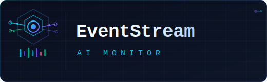

# EventStream AI Monitor

  

## Status

EventStream AI Monitor is currently in the **technology evaluation phase**. We are systematically comparing different architectural patterns, databases, messaging systems, and frameworks to make informed decisions based on benchmarking data. Each evaluation phase will be documented in its respective ADR (Architecture Decision Record).

No production code has been merged yet. All experiments are isolated in `backend/experiments/` following our systematic evaluation approach.

## Overview

EventStream AI Monitor is a platform that receives events from distributed systems and triggers automated actions based on user-defined rules. It leverages AI to classify, summarize, and interpret incoming events, enabling teams to monitor and react to system behavior intelligently.

## Problem Statement

Modern applications generate large volumes of events and logs. Teams often struggle to identify patterns, classify issues, and respond quickly to critical situations. EventStream AI Monitor solves this by providing an intelligent monitoring layer that automates responses and adds AI-powered insights to events.

## Value Proposition

- Monitor system events in real-time
- Automatically classify and analyze events using AI
- Trigger actions based on customizable rules
- Gain insights through a dashboard with metrics and visualizations

## Systematic Technology Evaluation Approach

We are following a systematic, phased approach to evaluate and compare different technology categories, ensuring that decisions are made based on concrete data and observed performance characteristics:

- **Phase 1**: Architecture comparison (Hexagonal vs Clean vs Onion) with fixed technologies: **FastAPI** and **PostgreSQL**.
- **Phase 2**: Database comparison (PostgreSQL vs MongoDB vs SQLite) with chosen architecture
- **Phase 3**: Messaging comparison (Kafka vs RabbitMQ vs Local Queue) with chosen architecture and database
- **Phase 4**: Framework comparison (FastAPI vs Django vs Flask) with chosen stack
- **Phase 5**: AI integration comparison (Hugging Face API vs Local Models) with chosen stack

**Why this approach?** By fixing all other variables during each evaluation phase, we ensure that benchmark results reflect the true performance and characteristics of the technology being tested, not side effects from other components. This methodology prevents misleading comparisons where differences might be attributed to the wrong variable.

### Current Progress (Phase 1 - Architecture)

- **Hexagonal Architecture Experiment**: Implemented core structure, domain entities, use cases, and input/output adapters.
- **Unit Tests**: Developed comprehensive unit tests for all layers (domain, use case, controller, repository).
- **Static Benchmarking**: Executed initial benchmarking suite focusing on:
    - Code Coverage (pytest-cov)
    - Cyclomatic Complexity (radon)
    - Maintainability Index (radon)
    - Linting (ruff)
    - Type Checking (mypy) - *Identified several type-related issues for improvement*
    - Dependency Analysis (pipdeptree, pydeps)
- **Results**: Baseline metrics established for Hexagonal Architecture. Results are documented in `docs/03-benchmarking-and-performance-analysis/architectures/benchmark-results/01-hexagonal-architecture/`.

## Technologies Under Evaluation

- **Backend framework**: FastAPI vs Django vs Flask
- **Database**: PostgreSQL vs MongoDB vs SQLite
- **Messaging**: Kafka vs RabbitMQ vs Local Queue
- **AI Integration**: Hugging Face API vs Local Models (Transformers/Ollama)
- **Architecture**: Hexagonal vs Clean vs Onion

_All technology choices will be validated and documented in our ADRs._

## MVP Scope (Planned)

The MVP will include:

- Event reception via webhook
- Event storage and retrieval
- Rule-based action triggering
- AI-powered event classification
- Dashboard with metrics

_All components will be evaluated through systematic benchmarking and documented architectural decisions._

## Getting Started

To explore technology experiments:

1.  Clone the repo
2.  Navigate to `backend/experiments/`
3.  Review each implementation and benchmark results in `docs/03-benchmarking-and-performance-analysis/`

Full setup instructions will be added after technology selection phases are complete.

---

## 👤 Maintained By
This project is developed and maintained by **FM ByteShift Software**

**Fernando Magalhães**  
CEO – FM ByteShift Software  
📞 (21) 97250-1546  
✉️ [contact@fmbyteshiftsoftware.com](mailto:contact@fmbyteshiftsoftware.com)  
🌐 [fmbyteshiftsoftware.com](https://fmbyteshiftsoftware.com)  
🏢 CNPJ: 62.145.022/0001-05 (Brazil)